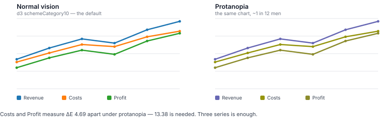

<div align="center">

# paletteguard

**Find the chart colours your colourblind users can't tell apart — in CI, before they ship.**

[](https://github.com/Rudevin17/paletteguard/actions/workflows/ci.yml)
[](https://www.npmjs.com/package/paletteguard)
[](LICENSE)
[](package.json)

</div>

---

Your revenue line is green. Your expenses line is amber. It looks fine.

To roughly **1 in 12 men**, those two lines are the same colour.

You will never get a bug report about it. People squint, guess, misread the
chart, and quietly trust your product a little less.



That is not an illustration. It is d3's default palette, the first three colours,
rendered through a colour vision deficiency simulation. **Three series is enough.**

```console
$ npx paletteguard chart-colors.json

  paletteguard — 4 colours, 18 comparisons

  ✗ FAIL  accent vs danger
         deuteranopia (green-blind)
         seen as #a7a788 · #9b9b5d
         distance 8.96  ·  needs 12.19

  ✗ FAIL  accent vs amber
         protanopia (red-blind)
         seen as #c1c185 · #bbbb41
         distance 9.87  ·  needs 13.38

  ────────────────────────────────────────────
  2 fail · 1 warn · 15 pass
```

Exit code `1`. The build stops.

## Quick start

```bash
npx paletteguard palette.json      # no install
npm install -D paletteguard        # or keep it around
```

```bash
# see it fail on d3's default, right now
echo '["#1f77b4","#ff7f0e","#2ca02c"]' | npx paletteguard
```

---

## Contents

- [Every major charting default fails](#every-major-charting-default-fails)
- [Why this exists](#why-this-exists)
- [Background: what is actually being measured](#background-what-is-actually-being-measured)
- [How it works](#how-it-works)
- [How the threshold is set](#how-the-threshold-is-set)
- [Input formats](#input-formats)
- [Options](#options)
- [Continuous integration](#continuous-integration)
- [As a library](#as-a-library)
- [How this compares](#how-this-compares)
- [What this does not do](#what-this-does-not-do)
- [FAQ](#faq)

---

## Every major charting default fails

I pointed it at the default categorical palettes shipped by the major charting
libraries. **Every one has pairs a colourblind reader cannot reliably separate.**

Libraries hand out colours in order, so the question that matters is not whether
a ten-colour palette hides a bad pair somewhere — it is *how many series before
something breaks*.

| Palette | Breaks at | The pair |
|---|---|---|
| d3 `schemeCategory10` | **3 series** | `#ff7f0e` vs `#2ca02c` — ΔE 4.69, protanopia |
| Chart.js defaults | **4 series** | `#ff9f40` vs `#ffcd56` — ΔE 7.57, deuteranopia |
| d3 `schemeTableau10` | **5 series** | `#e15759` vs `#59a14f` — ΔE 2.26, deuteranopia |
| d3 `schemeObservable10` | **5 series** | ΔE 6.01, protanopia |
| Wong (reference) | **never** | — |

The closest pair found anywhere: `schemeTableau10`'s `#ff9da7` against `#bab0ab`,
**ΔE 1.12** under protanopia. They simulate to `#aeaea7` and `#b2b2ab`. For
practical purposes, one colour.

**[Full audit — with controls, limitations, and the objection I can't rebut →](docs/audit.md)**

## Why this exists

I built an app, cared about accessibility, did the contrast maths, and shipped a
dashboard where **success-green and error-red are nearly identical** to the most
common form of colourblindness. Two people looked at it. Neither saw anything
wrong — because you can't. You have to compute it.

Every existing colourblindness tool is a web page you paste colours into. That
helps only when a human remembers to check. This is a build step, so it catches
the problem when nobody remembers.

## Background: what is actually being measured

Colour vision works through three cone types, sensitive to long (L), medium (M)
and short (S) wavelengths. Colour vision deficiency is one of those cones being
absent or shifted.

| Condition | Cone affected | Commonly called | Roughly |
|---|---|---|---|
| **Protanopia** | L (long) | red-blind | red-green family |
| **Deuteranopia** | M (medium) | green-blind | red-green family |
| **Tritanopia** | S (short) | blue-blind | rare |

Around **300 million people** worldwide have some form — about **1 in 12 men**
and **1 in 200 women**. Roughly **95%** of them are men, because the genes for
the L and M cones sit on the X chromosome. **Red-green deficiency is ~99% of all
cases**, which is why paletteguard scores protanopia and deuteranopia more
strictly than tritanopia.

**An important distinction, and a real limitation of this tool.** The conditions
above are *dichromacies* — a cone type missing outright. The milder and more
common conditions are *anomalous trichromacies* (protanomaly, deuteranomaly),
where the cone is present but its sensitivity is shifted. paletteguard simulates
the dichromacies, so **its results are a worst case**, not what every colourblind
reader experiences.

That is a deliberate choice: a palette that survives the severe case survives the
mild one, and the reverse is not true.

## How it works

```
palette → simulate 3 conditions → every pair → CIEDE2000 → compare to floor
```

1. **Parse** the input into named colours.
2. **Simulate** each colour under protanopia, deuteranopia and tritanopia, via
   [`@bjornlu/colorblind`](https://github.com/bluwy/colorblind) — a zero-dependency
   implementation of [hx2A's colour blindness simulation research](https://ixora.io/projects/colorblindness/color-blindness-simulation-research/).
3. **Compare every pair**, under each condition, using **CIEDE2000** perceptual
   distance.
4. **Verdict** per pair: `pass`, `warn` or `fail` against a per-condition floor.

### Why all pairs

Because a **categorical palette is by definition a set of colours meant to be
mutually distinguishable.** If two of them collide, that is a real defect
regardless of which two.

This is exactly why the tool is scoped to palettes and not to design tokens
generally: a linter cannot know that `--surface-raised` and `--surface-overlay`
are never meant to be told apart, so checking all pairs of a token file produces
mostly noise. Scoping to categorical palettes makes all-pairs correct by
construction.

### Why CIEDE2000

Perceptual difference formulas are not interchangeable:

- **CIE76** — plain Euclidean distance in CIELAB. Simple, but badly non-uniform
  in saturated colours and blues.
- **OKLab distance** — modern and well-behaved, but on a scale of roughly 0–0.4,
  which nobody recognises.
- **CIEDE2000** — the CIE's current standard, with corrections for lightness,
  chroma and hue interactions. It is what "ΔE" means to most people, on a
  familiar 0–100 scale.

paletteguard reports CIEDE2000 so its numbers can be compared with other tools.
OKLab distance was computed alongside during development and agreed on ordering.

## How the threshold is set

Not invented. **Measured.**

[Bang Wong's palette](https://www.nature.com/articles/nmeth.1618) (*Nature
Methods*, 2011) was published specifically as a categorical palette that survives
colour vision deficiency. paletteguard computes the smallest gap Wong itself
achieves under each condition, and holds your palette to that same bar:

```console
$ npx paletteguard --thresholds

  condition       fail below    pass at or above
  ────────────────────────────────────────────────
  protanopia          10.04               13.38
  deuteranopia         9.14               12.19
  tritanopia           7.34                9.79
```

The pass floor is **derived at runtime**, not hardcoded, so it can never drift
out of step with the simulation model. The fail floor is `0.75` of it.

That ratio is the single judgement call in the tool, so it is kept visible.
Measured across six palettes, the usable window is **0.75–0.90**: below 0.75 the
known-bad test fixture stops failing at all, and the reference palette stays
clean across the whole range. `0.75` therefore sits at the **lenient** end,
chosen so that a reported failure means something — a ratio tuned to maximise
failures would deserve the scepticism it got. Both edges are pinned by tests.

Note the floors differ per condition. A single flat threshold would be wrong:
Wong is weakest under tritanopia, which is also by far the rarest condition.

## Input formats

Whatever shape you already have:

```bash
paletteguard palette.json                  # ["#e69f00", "#56b4e9"]
paletteguard palette.json                  # { "revenue": "#e69f00", ... }
paletteguard theme.css --prefix chart      # --chart-1: #e69f00;
echo '["#e69f00","#56b4e9"]' | paletteguard
```

Also accepted: `[{ "name": "revenue", "color": "#e69f00" }]`, bare
whitespace-separated hex, shorthand `#abc`, and a UTF-8 BOM.

> **Name your colours if you can.** *"revenue and expenses are indistinguishable"*
> is actionable. *"#e69f00 and #56b4e9 are indistinguishable"* is a puzzle.

### One palette, not a whole stylesheet

Give it the colours that identify **series in a chart**.

A stylesheet is not a categorical palette — `--surface-raised` and
`--surface-overlay` are *meant* to look alike, and so are `--accent` and
`--accent-hover`. Comparing everything against everything reports failures that
aren't real. Narrow it with `--prefix chart`; paletteguard warns if you scan a
whole file unfiltered.

## Options

| Flag | |
|---|---|
| `--prefix <s>` | only CSS custom properties whose name contains `<s>` |
| `--json` | machine-readable output |
| `--verbose` | show passing pairs too |
| `--no-color` | disable terminal colour |
| `--thresholds` | print the calibrated floors and exit |
| `--help` | usage |

**Exit codes** — `0` pass or warn · `1` at least one pair failed · `2` bad input

## Continuous integration

```yaml
- uses: actions/setup-node@v4
  with:
    node-version: 20
- run: npx paletteguard src/theme.css --prefix chart
```

Anything that reads an exit code works — GitLab CI, a pre-commit hook, a
`package.json` script. Use `--json` if you want to post results somewhere.

## As a library

```ts
import { checkPalette } from "paletteguard";

const report = checkPalette([
  { name: "revenue", hex: "#3ddc84" },
  { name: "expenses", hex: "#ff6961" },
]);

report.verdict;                  // "fail"
report.findings[0].distance;     // 8.96
report.findings[0].condition;    // "deuteranopia"
report.findings[0].seen;         // { a: "#a7a788", b: "#9b9b5d" }
```

Also exported: `parsePalette`, `render`, `renderJson`, `seenAs`, `distance`,
`referenceFloors`, `PASS_FLOOR`, `FAIL_FLOOR`, `WONG`.

The check is importable on purpose. If a larger linter wants this capability,
depending on this module should be the easiest path available.

## How this compares

| | Checks CVD distinguishability | Runs in CI | Language |
|---|:---:|:---:|---|
| **paletteguard** | ✅ | ✅ | JS/TS |
| [`colorblindcheck`](https://jakubnowosad.com/colorblindcheck/) | ✅ | ❌ | R |
| [Viz Palette](https://projects.susielu.com/viz-palette) | ✅ | ❌ | web |
| Color Oracle | simulates only | ❌ | desktop |
| axe · Pa11y · Lighthouse | ❌ *(contrast)* | ✅ | JS |
| `color-contrast-checker` etc. | ❌ *(contrast)* | ✅ | JS |

`colorblindcheck` is the closest prior work and is good — but being an R package
means it cannot be installed into a JavaScript project or wired into a normal
front-end pipeline. The interactive tools are genuinely useful, and they help
only when someone remembers to open them.

## What this does not do

- **It does not check WCAG contrast.** A different failure mode, well covered by
  existing tools. This checks *distinguishability*, and staying out of contrast
  is the positioning rather than an oversight.
- **It does not claim WCAG compliance.** WCAG 1.4.1 requires that colour is not
  the *only* carrier of meaning; its remedy is labels and patterns as much as
  colour choice. Fixing a palette is necessary, not sufficient.
- **It does not suggest replacement colours.** Harder problem, and tools like
  [Leonardo](https://leonardocolor.io/) already generate palettes.
- **It does not handle sequential or diverging palettes.** Different maths,
  different rules. Categorical only.

## FAQ

<details>
<summary><b>Isn't it circular to grade palettes against Wong when Wong sets the bar?</b></summary>

Partly, yes — and it is the fairest objection. So ignore the thresholds and read
raw minimum distances: Wong scores **12.19**, the library defaults score
**1.12–3.84**. A 3–10× gap with no threshold involved. The
[audit](docs/audit.md) works through this, plus the stronger version of the
objection — that Wong is CVD-optimised and holding aesthetic palettes to it is a
value judgement rather than a measurement.
</details>

<details>
<summary><b>My chart has direct labels. Do I still care?</b></summary>

Less. If series are labelled, patterned or separated by position, colour is no
longer carrying the information alone — which is what WCAG 1.4.1 actually asks
for. paletteguard measures the colours, not the whole chart. A failing pair on a
directly-labelled chart is a smaller problem than the same pair in a legend.
</details>

<details>
<summary><b>Why does a 10-colour palette fail when I only use 3 series?</b></summary>

It might not. Check what you actually use — pass only those three colours. The
audit reports *breaks at N* for exactly this reason: `schemeCategory10` fails at
three, but `schemeTableau10` survives to five.
</details>

<details>
<summary><b>Why is tritanopia scored more leniently?</b></summary>

Because it is far rarer — red-green deficiency is ~99% of cases — and because
the reference palette is itself weakest there. Tritanopia failures are still
reported, and marked *rare* so you can weigh them.
</details>

<details>
<summary><b>Can I change the threshold?</b></summary>

Not in 0.1.0. The floors are derived from a published reference on purpose, and a
`--threshold` flag mostly invites people to tune until the build passes. If you
have a real case for it, open an issue.
</details>

## Contributing

See [CONTRIBUTING.md](CONTRIBUTING.md). The scope is deliberately narrow and the
boundaries are written down.

## Prior art and credit

- [`@bjornlu/colorblind`](https://github.com/bluwy/colorblind) — the CVD
  simulation this is built on, based on [hx2A's research](https://ixora.io/projects/colorblindness/color-blindness-simulation-research/)
- [`culori`](https://culorijs.org/) — colour conversion and CIEDE2000
- [Bang Wong, *Points of view: Color blindness*](https://www.nature.com/articles/nmeth.1618),
  Nature Methods 8, 441 (2011) — the reference palette
- [`colorblindcheck`](https://jakubnowosad.com/colorblindcheck/) — the same idea
  in R, and the closest thing that existed before this

## Licence

MIT © Rudevin Cosejo
